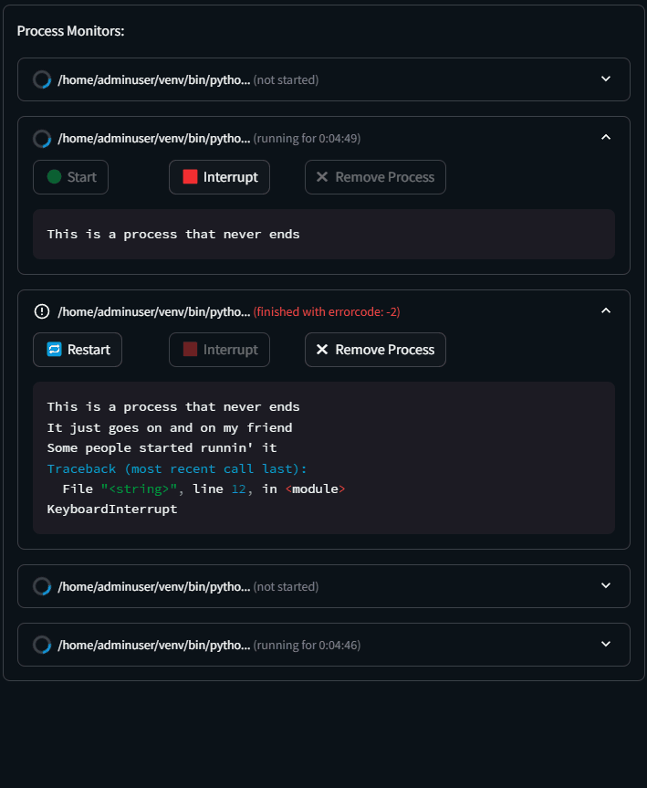

# Streamlit Process Manager


Let's be honest, trying to manage external processes or subprocesses from a [Streamlit](https://github.com/streamlit/streamlit) app is tricky. The execution model makes it difficult to keep track of which processes are supposed to be running and which ones aren't. Half the time you end up spawning twenty different processes all trying to access the same file and stomping all over one another.

Streamlit Process Manager attempts to make a that a bit easier. It looks something like this:

```python
import streamlit_process_manager as spm

# Get the global ProcessManager
pm = spm.get_manager()

# Configure the Process and start it
my_program = ["python", "my_program.py"]
output_file = "program_output.txt"
process = pm.single(spm.Process(my_program, output_file))
process.start_safe()

# Run the process and monitor it in streamlit!
spm.st_process_monitor(process).loop_until_finished()
```

> ⚠️ **DISCLAIMER** ⚠️
>
> Runing processes on your machine from a public-facing
  application like a Streamlit app can be _incredibly_ risky and comes
  with all sorts of security considerations. Use this project on public apps
  at your own risk, and **never** inject user-provided values or arguments
  into your processes without serious consideration of all the possible injection
  attacks you might be opening your server up to.

## Installation

`pip install streamlit-process-monitor`

Requires
* `Python 3.8.*` or above
* `Streamlit 1.30.*` or above
* `psutil 5.9.8` or above


## Development

This project uses [`pdm`](https://pdm-project.org/) for most of its development tooling. Ensure you have `python3.8` installed, then run

```
pip install pdm
pdm venv create 3.8
pdm install --dev --group test --group lint
```

to get started, then run

```
pdm check
```

to verify that everything is set up and ready to go.

> If you must use Python 3.12 or greater, you may have issues with numpy 1.24 needing to be
  built from source since it only supports python versions up to 3.11.

### Testing with tox

If you have multiple versions of Python available on your system you can use `tox` to run tests
on all of them at once. `tox` should be installed when you install the `--dev` dependencies so
you can just run it. Any Python's not available on your system will be skipped.

```
pdm run tox
```
